# KAN 在托卡马克能量约束时间定标中的应用

## 摘要

本项目以 ITPA H 模能量约束时间数据库为研究对象，比较了三类模型：经典 log-log 幂律 OLS、黑箱非线性 MLP，以及具有函数级可解释性的 Kolmogorov-Arnold Network（KAN）。模型输入采用 9 个工程变量：`BT`, `IP`, `NEL`, `PL`, `RGEO`, `EPSILON`, `KAPPA`, `DELTA`, `MEFF`，目标变量为总能量约束时间 `TAUTH`。建模任务统一写成

$$
\log(\tau_E)=f(\log B_T,\log I_P,\log \bar n_e,\log P_L,\log R,\log \epsilon,\log \kappa,\log \delta,\log M_{\rm eff}).
$$

本版 v3 将评估口径拆成三层：

1. `extrap_jet` 作为主性能测试：全库按 `TAUTH` 降序取前 20%，只保留其中 `1505` 条高 `TAUTH` `JET` 样本作为测试集；
2. `group split by TOK` 作为补充压力测试，用于检查跨装置泛化与失稳模式；
3. `random split` 只用于可解释性分析，因为局部指数与符号表达式需要依赖更完整的数据分布。

当前结果显示，在高 `TAUTH` 单装置外推测试中，OLS 和 MLP 表现接近，而 KAN 反而更差；在既有 `group split` 补充测试中，OLS 仍最稳，MLP 明显退化，KAN 则出现拟合崩溃。与此同时，random split 的 9 变量局部指数分析表明：`IP` 和 `PL` 最接近稳定幂律，而 `BT`、`RGEO`、`EPSILON` 等变量表现出更强状态依赖。KAN 的真正价值因此不应表述为“最稳健预测器”，而应定位为一种用于诊断非线性定标关系、状态依赖局部指数以及可稀疏化函数结构的可解释建模工具。

---

## 1. 研究背景

托卡马克能量约束时间通常采用经验幂律形式描述：

$$
\tau_E =
C I_P^{\alpha_I}
B_T^{\alpha_B}
\bar n_e^{\alpha_n}
P_L^{\alpha_P}
R^{\alpha_R}
\epsilon^{\alpha_\epsilon}
\kappa^{\alpha_\kappa}
\delta^{\alpha_\delta}
M_{\rm eff}^{\alpha_M}.
$$

在对数空间中，上式可写为

$$
\log \tau_E =
\log C +
\alpha_I \log I_P +
\alpha_B \log B_T +
\alpha_n \log \bar n_e +
\alpha_P \log P_L +
\alpha_R \log R +
\alpha_\epsilon \log \epsilon +
\alpha_\kappa \log \kappa +
\alpha_\delta \log \delta +
\alpha_M \log M_{\rm eff}.
$$

这一写法的优势是：回归系数可直接解释为全局定标指数；其局限是：默认每个变量的指数在整个数据库中都是常数。对于跨装置、跨运行区间的 ITPA H 模数据库，这一假设很可能只在部分变量上近似成立。

因此，本项目的核心问题是：

> 固定幂律定标在 ITPA H 模数据库中哪些变量上近似成立，哪些变量上表现出明显的状态依赖非线性？

---

## 2. 研究目标

### 2.1 建立三类基准模型

| 模型 | 定位 |
|---|---|
| OLS | 经典 log-log 幂律定标基线 |
| MLP | 黑箱非线性神经网络基线 |
| KAN | 具有函数级可解释性的非线性模型 |

### 2.2 区分三种评估口径

- `extrap_jet`：高 `TAUTH` 单装置外推测试，用于检验模型在高约束时间尾部的外推性能；
- `group split by TOK`：跨装置压力测试，用于检验分布转移下的稳健性；
- `random split`：只用于解释性分析，用于得到更稳定的局部指数统计与符号表达式。

### 2.3 分析 KAN 的结构可解释性

KAN 的优势不仅在于非线性拟合，还在于可以进一步开展：

- 网络函数可视化；
- 稀疏化；
- 剪枝；
- 符号表达式提取。

这些能力使 KAN 更适合作为科学建模中的“可解释函数发现工具”。

---

## 3. 数据、变量与切分

### 3.1 输入变量

| 变量 | 含义 |
|---|---|
| `BT` | 托罗向磁场 |
| `IP` | 等离子体电流 |
| `NEL` | 线平均电子密度 |
| `PL` | 功率损失或加热功率相关量 |
| `RGEO` | 主半径 |
| `EPSILON` | 反纵横比 |
| `KAPPA` | 伸长率 |
| `DELTA` | 三角形度 |
| `MEFF` | 有效离子质量 |

### 3.2 目标变量

| 变量 | 含义 |
|---|---|
| `TAUTH` | 总能量约束时间 |

### 3.3 预处理

统一采用 log-space 建模。令

$$
x_i'=\log x_i,\qquad y'=\log \tau_E.
$$

对于 OLS，直接在 log-log 空间回归。对于 MLP 和 KAN，进一步对输入和输出进行标准化：

$$
\tilde x_i=\frac{x_i'-\mu_{x_i}}{\sigma_{x_i}},
\qquad
\tilde y=\frac{y'-\mu_y}{\sigma_y}.
$$

局部指数从标准化梯度恢复为物理意义上的对数指数：

$$
\frac{\partial \log \tau_E}{\partial \log x_i}
=
\frac{\sigma_y}{\sigma_{x_i}}
\frac{\partial \tilde y}{\partial \tilde x_i}.
$$

### 3.4 本版 v3 的三种切分

#### `extrap_jet` 主测试

在清洗后的 `7546` 条样本上：

1. 按 `TAUTH` 全局降序排序；
2. 取前 20% 共 `1510` 条作为 top bucket；
3. 只保留其中 `TOK == JET` 的 `1505` 条作为测试集；
4. top bucket 中其余 `5` 条非 `JET` 样本返回训练池；
5. 从训练池中按 `TAUTH` 再降序取 `755` 条作为高端验证集；
6. 剩余 `5286` 条作为训练集。

这一切分应理解为：

> 单装置高约束时间外推测试，而不是跨装置外推测试。

#### `group split by TOK` 补充测试

按装置标识 `TOK` 做组切分。该测试专门用于检查跨装置分布转移下的稳健性。

#### `random split` 解释性测试

random split 不再承担主性能结论，只用于解释性分析，因为它保留了更完整的整体分布，适合做局部指数与符号表达式诊断。

---

## 4. KAN 原理

### 4.1 MLP 与 KAN 的结构差异

传统 MLP 的基本层结构为

$$
\mathbf h^{(l+1)}
=
\sigma\!\left(W^{(l)}\mathbf h^{(l)}+\mathbf b^{(l)}\right).
$$

其中，$W^{(l)}$ 是线性权重矩阵，$\sigma$ 是固定激活函数，例如 ReLU、GELU 或 SiLU。MLP 的非线性主要来自节点上的固定激活函数。

KAN 的思想不同。KAN 将可学习函数放在网络边上，而不是只在节点上使用固定激活函数。形式上，KAN 与 Kolmogorov-Arnold 表示定理相关。对于多元函数 $f(x_1,\ldots,x_n)$，Kolmogorov-Arnold 型表示可写为

$$
f(x_1,\ldots,x_n)
=
\sum_{q=1}^{2n+1}
\Phi_q
\left(
\sum_{p=1}^{n}
\phi_{q,p}(x_p)
\right).
$$

其中，$\phi_{q,p}$ 与 $\Phi_q$ 都是一维函数。KAN 的网络实现将这些一维函数参数化为可学习函数，通常使用样条函数表示。

### 4.2 KAN 的可解释性来源

1. 边函数是一维可学习函数，而不是单个标量权重；
2. 可以通过稀疏化和剪枝删除弱连接；
3. 可以尝试将剪枝后的结构符号化，提取显式表达式。

因此，KAN 的核心优势不只是“预测更准”，更在于更容易从训练后的模型中提取结构信息。

---

## 5. 与本项目相关的 KAN 工作

### 5.1 KAN 原始论文

KAN 原始论文强调其在科学问题中的潜力：不仅用于拟合数据，也用于帮助研究者识别函数结构与潜在规律。这与托卡马克能量约束时间定标问题高度一致。

### 5.2 Hydro-KAN：透明经验建模

Hydro-KAN 在水文学中强调 hybrid and transparent modeling，即不仅关注预测性能，也关注模型结构与变量作用的透明性。这与本项目的目标非常接近。

### 5.3 KAN 与科学发现、符号回归

后续 KAN 相关工作进一步强调其在科学发现、模块结构识别和符号表达式构造中的用途。本项目当前尚未得到最终物理定标公式，但已经完成了第一步：利用 KAN 做稀疏化、剪枝和符号表达式尝试。

---

## 6. 模型设置

### 6.1 全局设置

| 设置 | 数值 |
|---|---|
| 随机种子 | `42` |
| 测试集比例 | `0.20` |
| 验证集比例 | `0.10` |
| 输入变量数 | `9` |
| 目标变量 | `TAUTH` |
| 分组列 | `TOK` |
| 主配置文件 | `configs/final_baseline.yaml` |

### 6.2 OLS

OLS 在 log-log 空间中拟合：

$$
\log \tau_E = \beta_0 + \sum_{i=1}^9 \beta_i \log x_i.
$$

其中 $\beta_i$ 即全局固定幂律指数。

### 6.3 MLP 搜索空间

| 参数 | 取值 |
|---|---|
| `hidden_dims` | `[64,32]`, `[128,64]`, `[64,32,16]`, `[128,64,32]` |
| `activation` | `silu`, `gelu` |
| `dropout` | `0.0`, `0.05`, `0.10` |
| `lr` | `3e-4`, `1e-3` |
| `weight_decay` | `1e-4`, `1e-3` |
| `batch_size` | `128`, `256` |
| `max_trials` | `18` |
| `max_epochs` | `500` |
| `patience` | `50` |

当前 `extrap_jet` 最优 MLP 参数为：

| 参数 | 数值 |
|---|---|
| `hidden_dims` | `[64,32]` |
| `activation` | `silu` |
| `dropout` | `0.0` |
| `lr` | `0.001` |
| `weight_decay` | `0.001` |
| `batch_size` | `128` |

补充 `group split` 测试中，当前项目既有 run 的最优 MLP 参数为：

| 参数 | 数值 |
|---|---|
| `hidden_dims` | `[128,64,32]` |
| `activation` | `gelu` |
| `dropout` | `0.1` |
| `lr` | `0.001` |
| `weight_decay` | `0.0001` |
| `batch_size` | `256` |

### 6.4 KAN 搜索空间

| 参数 | 取值 |
|---|---|
| `hidden_dims` | `[8]`, `[16]`, `[32]`, `[8,4]`, `[16,8]` |
| `grid` | `3`, `5`, `7` |
| `k` | `3`, `5` |
| `adam_steps` | `500`, `1000` |
| `adam_lr` | `3e-4`, `1e-3` |
| `lbfgs_steps` | `60`, `120` |
| `lamb` | `0`, `1e-5`, `1e-4`, `1e-3` |
| `lamb_entropy` | `0`, `1`, `2` |
| `max_trials` | `16` |

表中 `rmse_log` 属于搜索阶段验证集 RMSE，最终测试集 RMSE 统一见第 7 节。

当前 `extrap_jet` 最优 KAN 参数为：

| 参数 | 数值 |
|---|---|
| `hidden_dims` | `[8]` |
| `grid` | `5` |
| `k` | `5` |
| `adam_steps` | `1000` |
| `adam_lr` | `0.0003` |
| `lbfgs_steps` | `120` |
| `lamb` | `0.0001` |
| `lamb_entropy` | `2.0` |

补充 `group split` 测试中，当前项目既有 run 的最优 KAN 参数为：

| 参数 | 数值 |
|---|---|
| `hidden_dims` | `[16,8]` |
| `grid` | `5` |
| `k` | `5` |
| `adam_steps` | `500` |
| `adam_lr` | `0.001` |
| `lbfgs_steps` | `60` |
| `lamb` | `1e-5` |
| `lamb_entropy` | `0.0` |

---

## 7. Baseline 结果

### 7.1 主结果：`extrap_jet`

| Model | Split | RMSE(log) | MAE(log) | R²(log) | Median relative error | Mean relative error |
|---|---|---:|---:|---:|---:|---:|
| OLS | extrap_jet | 0.2611 | 0.2259 | 0.3386 | 0.1996 | 0.1974 |
| MLP | extrap_jet | 0.2579 | 0.2265 | 0.3549 | 0.2137 | 0.2058 |
| KAN | extrap_jet | 0.3654 | 0.3199 | -0.2955 | 0.2855 | 0.3116 |

这一主测试的含义非常具体：测试集由 `1505` 条高 `TAUTH` `JET` 样本组成，因此它检验的是“单装置高约束时间尾部外推能力”，而不是跨装置外推。

在这一口径下：

- OLS 与 MLP 的表现接近，MLP 略优；
- KAN 明显更差，`R²(log)` 已经变为负值；
- 这说明在高 `TAUTH` 尾部外推任务中，更复杂的非线性结构并不自动带来收益。

换句话说，本版主结果支持的是：

> 对高约束时间 JET 尾部样本，简单幂律与中等复杂度 MLP 已足以给出相近表现，而当前 KAN 配置并未显示出外推优势。

### 7.2 补充压力测试：`group split by TOK`

| Model | Split | RMSE(log) | MAE(log) | R²(log) | Median relative error | Mean relative error |
|---|---|---:|---:|---:|---:|---:|
| OLS | group | 0.2530 | 0.2040 | 0.9133 | 0.1797 | 0.2182 |
| MLP | group | 0.6266 | 0.4976 | 0.4686 | 0.3790 | 0.4275 |
| KAN | group | 1.3604 | 0.7141 | -1.5049 | 0.4565 | 0.5533 |

这里保留的是当前项目既有 `group split` run，用作补充压力测试。这个结果不应写成“性能下降”，而应明确写成：

> KAN 在 `group split` 下出现拟合崩溃。

原因至少包括三点：

1. 该 trial 选到的是 `lamb=1e-5`、`lamb_entropy=0.0`，几乎无正则；
2. `hidden_dims=[16,8]` 较深，在少装置训练下更容易过拟合；
3. `group split` 本身引入了显著的跨装置分布转移。

因此，`group split` 的结论不是“KAN 稍差于 OLS”，而是：

> 在当前配置下，KAN 对跨装置分布转移高度敏感，并可能出现训练后测试集拟合崩溃。

---

## 8. Prediction vs Actual 图

### 8.1 OLS `extrap_jet`

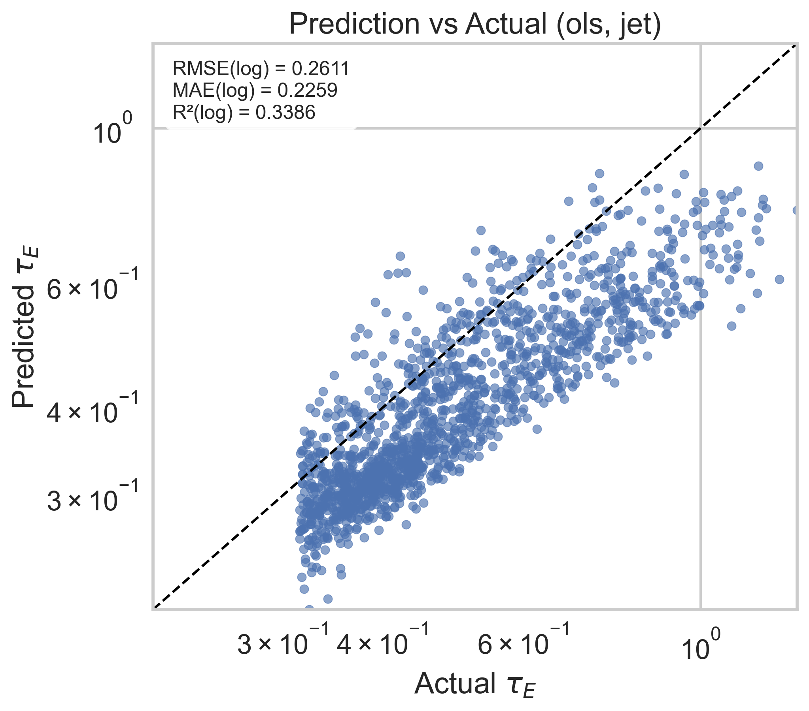

### 8.2 MLP `extrap_jet`

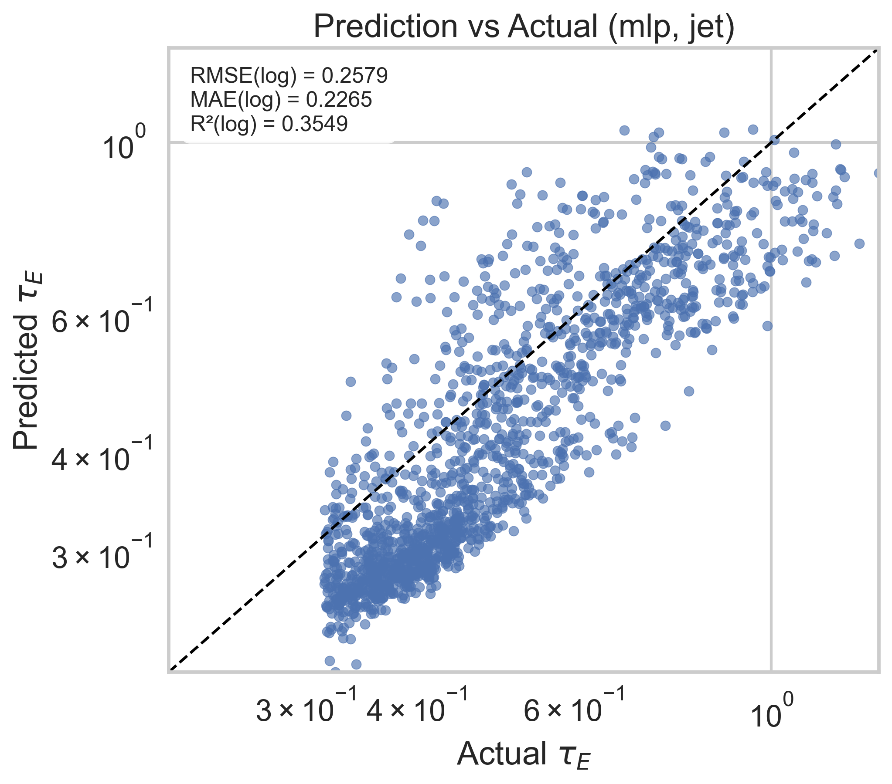

### 8.3 KAN `extrap_jet`

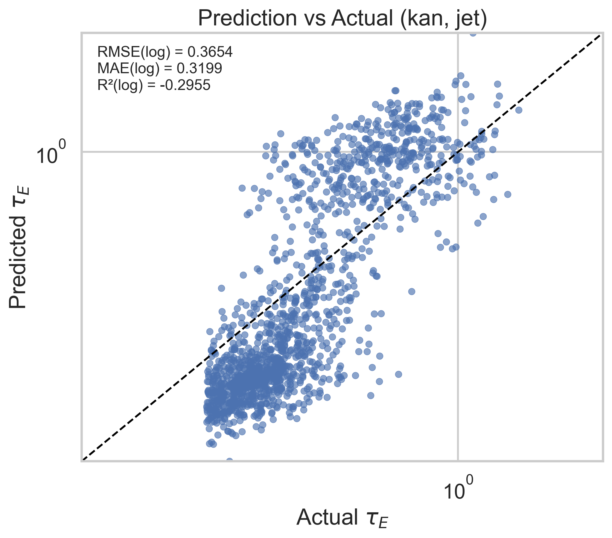

### 8.4 OLS `group`

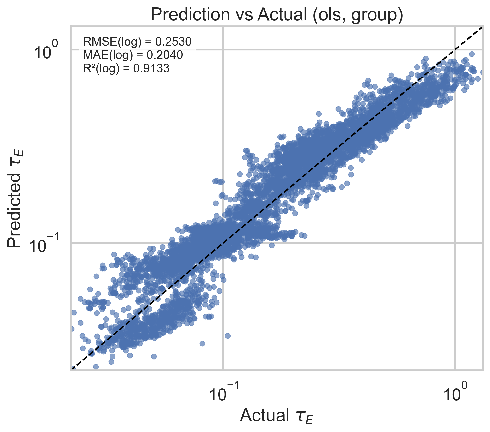

### 8.5 MLP `group`

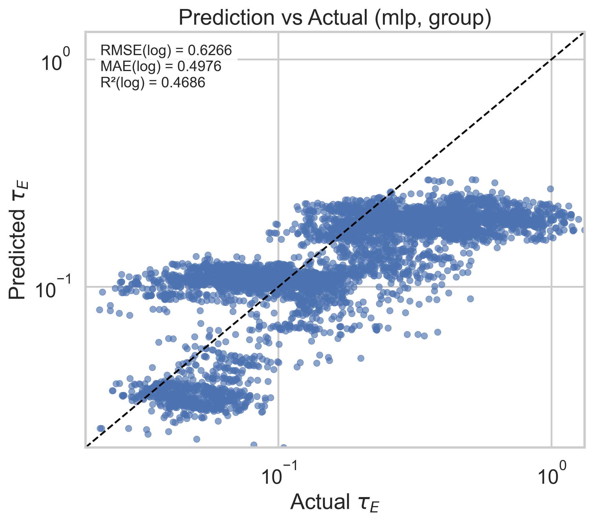

### 8.6 KAN `group`

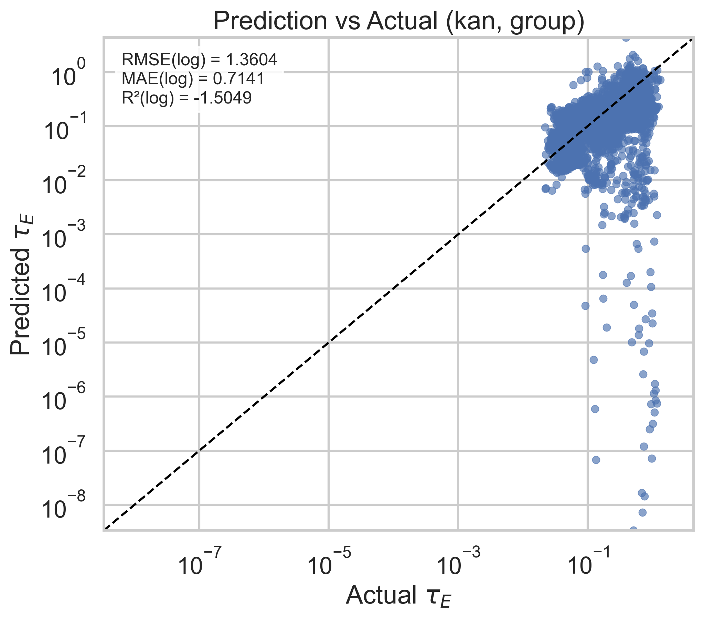

这些图与第 7 节结论一致：在 `extrap_jet` 主测试中，OLS 和 MLP 的点云更接近 `y=x` 参考线，而 KAN 偏差更大；在补充 `group split` 测试中，KAN 的预测明显失稳。

---

## 9. MLP 与 KAN 的局部指数分析

### 9.1 局部指数定义

对可微模型，定义变量 $x_i$ 的局部对数指数为

$$
\alpha_i(x)=\frac{\partial \log \tau_E}{\partial \log x_i}.
$$

若模型是固定幂律，则 $\alpha_i(x)$ 为常数；若 $\alpha_i(x)$ 随状态变化，则说明变量作用具有状态依赖性。

需要强调的是：

> 局部指数分析不是 KAN 独有的，MLP 同样可以通过自动微分计算局部指数。

因此，本项目对 MLP 与 KAN 做的是同口径比较。

### 9.2 `OLS` 全局指数 vs `MLP` 局部指数 vs `KAN` 局部指数

下表统一使用 `random split` 的解释性输出，因为该口径覆盖了更完整的数据分布。`OLS coef` 来自 random OLS 的全局幂律指数；`MLP/KAN p10/p50/p90` 来自 test-set 局部指数分布分位数。

| Feature | OLS coef | MLP p10 | MLP p50 | MLP p90 | KAN p10 | KAN p50 | KAN p90 |
|---|---:|---:|---:|---:|---:|---:|---:|
| `BT` | 0.1245 | -0.7327 | -0.0966 | 0.5800 | -2.3252 | 0.1560 | 1.6886 |
| `IP` | 1.0471 | 0.5973 | 1.4069 | 1.9271 | -0.1680 | 1.2631 | 2.8247 |
| `NEL` | 0.1198 | -0.3279 | -0.0307 | 0.5460 | -0.7924 | 0.1809 | 0.9668 |
| `PL` | -0.6517 | -1.0543 | -0.7685 | -0.4984 | -1.3790 | -0.7666 | -0.1708 |
| `RGEO` | 1.4770 | 0.5242 | 1.0661 | 2.7215 | -0.4727 | 2.6169 | 6.5450 |
| `EPSILON` | 0.0537 | -0.9767 | -0.1818 | 0.7341 | -3.0431 | 0.5443 | 4.4324 |
| `KAPPA` | 0.1866 | -3.4159 | 0.9829 | 2.4316 | -7.1669 | 1.0891 | 6.1914 |
| `DELTA` | 0.2189 | -0.4827 | 1.0301 | 2.6056 | -5.0583 | 1.8257 | 8.1928 |
| `MEFF` | 0.2973 | -0.4261 | 0.6459 | 1.3281 | -2.1725 | 0.2141 | 2.3194 |

### 9.3 变量层面的解释

#### 更接近固定幂律的变量

- `IP`：OLS 全局指数 `1.0471`，MLP 与 KAN 的中位局部指数分别为 `1.4069` 和 `1.2631`，符号一致且幅值接近，是最稳定的正相关主变量。
- `PL`：OLS 全局指数 `-0.6517`，MLP 与 KAN 的中位局部指数分别为 `-0.7685` 和 `-0.7666`，三者高度一致，是最清晰的负相关变量。

#### 中位数可对齐，但分布较宽的变量

- `NEL`：OLS 指数 `0.1198`，MLP 中位数略负，KAN 中位数略正，说明其作用较弱且依赖状态。
- `MEFF`：OLS 指数 `0.2973`，MLP 中位数 `0.6459`，KAN 中位数 `0.2141`，符号基本一致，但局部波动不可忽略。
- `KAPPA` 与 `DELTA`：MLP 与 KAN 的中位数都偏正，但分布范围很宽，说明几何变量不能只用单一固定指数概括。

#### 明显表现出状态依赖的变量

- `BT`：OLS 指数仅 `0.1245`，但 MLP 与 KAN 的局部指数都跨过正负两侧，说明 `BT` 作用明显依赖状态。
- `RGEO`：OLS 指数 `1.4770`，MLP 中位数 `1.0661` 尚可，而 KAN 中位数 `2.6169` 且分布极宽，显示出强烈的状态依赖与装置尺度耦合。
- `EPSILON`：OLS 指数接近 `0`，但 MLP 与 KAN 的局部指数分布都很宽，说明它更像非线性修正变量，而不是稳定幂律主项。

因此，本项目关于“哪些变量近似幂律”的证据链可以明确写成：

> `IP` 与 `PL` 最接近稳定幂律；`NEL` 与 `MEFF` 为弱或中等稳定变量；`BT`、`RGEO`、`EPSILON` 以及部分几何变量表现出更明显的状态依赖。

---

## 10. KAN 响应曲线与局部指数图

下述图均来自 `random split` 的 KAN interpretability。为了避免正文过长，这里只展示代表性变量；其余 `EPSILON/KAPPA/DELTA/MEFF` 的 summary panel 已在当前 outputs 中重新生成。

### 10.1 KAN：IP

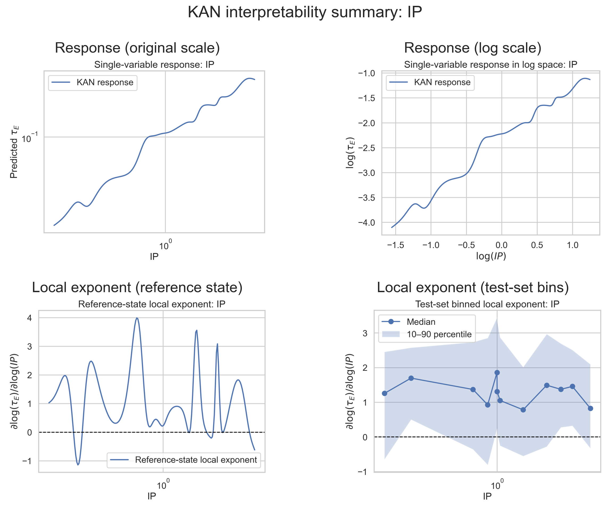

### 10.2 KAN：PL

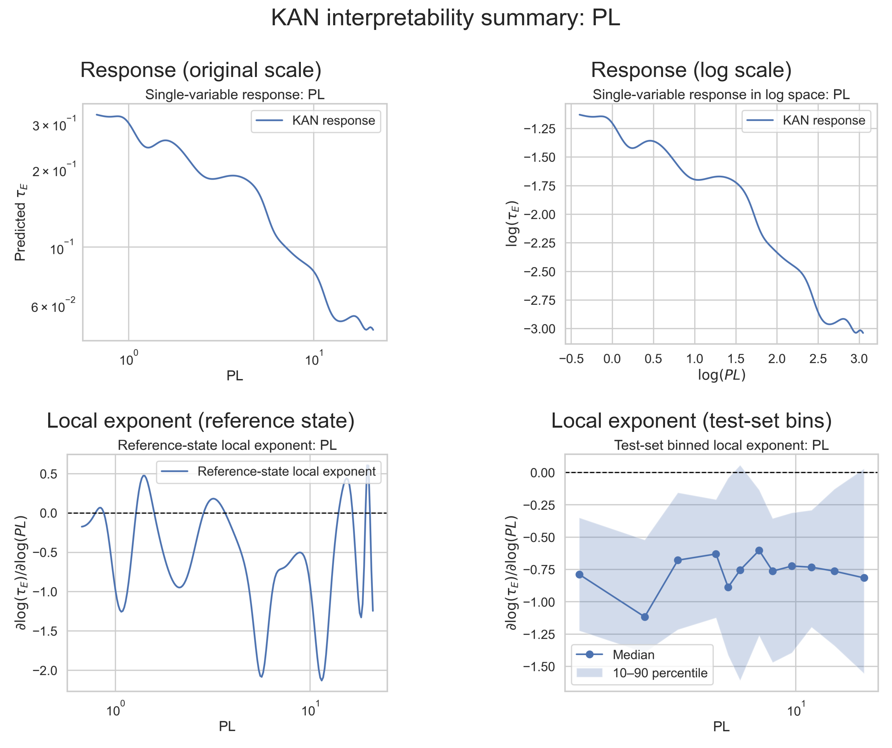

### 10.3 KAN：BT

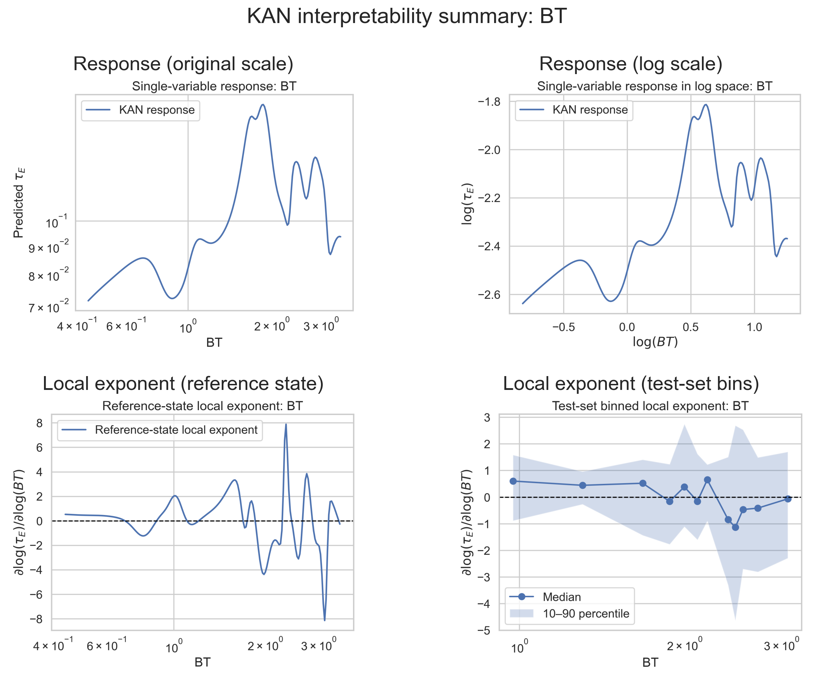

### 10.4 KAN：NEL

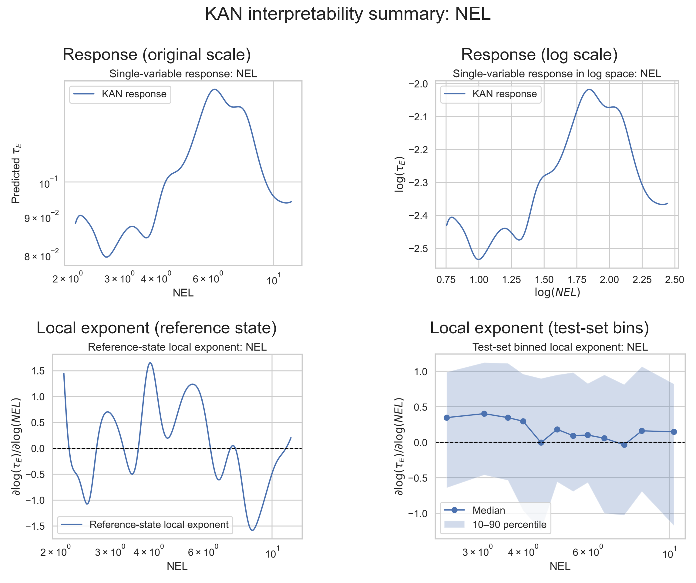

### 10.5 KAN：RGEO

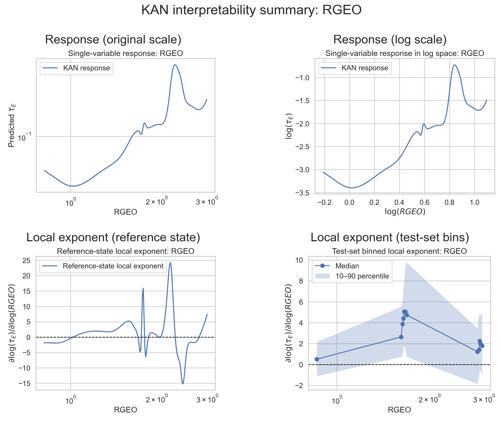

其中最稳的两类趋势仍然是：

- `IP` 整体单调上升；
- `PL` 整体单调下降。

而 `BT` 与 `RGEO` 的响应更明显地偏离单一固定指数图景。

---

## 11. MLP 响应曲线与局部指数图

同样地，下述图来自 `random split` 的 MLP interpretability；其余 `EPSILON/KAPPA/DELTA/MEFF` 的图已在当前 outputs 中生成。

### 11.1 MLP：IP

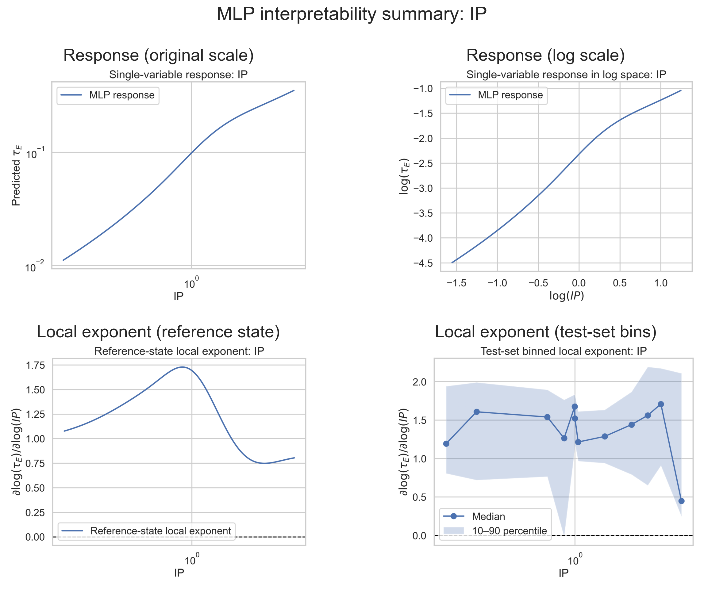

### 11.2 MLP：PL

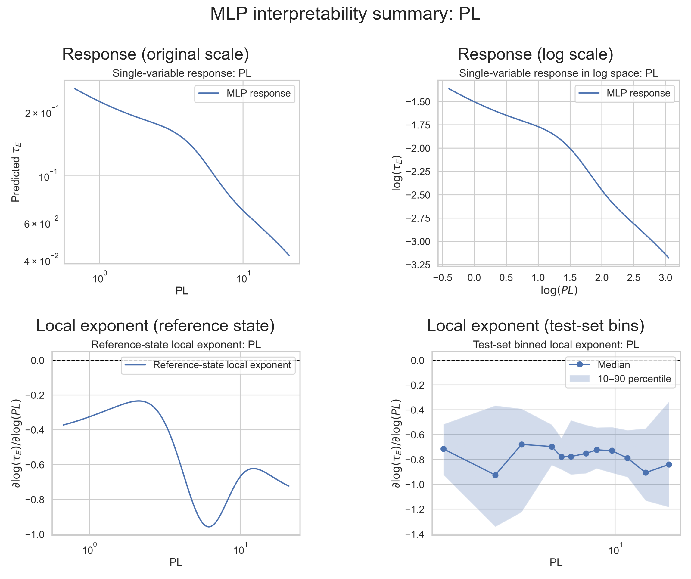

### 11.3 MLP：BT

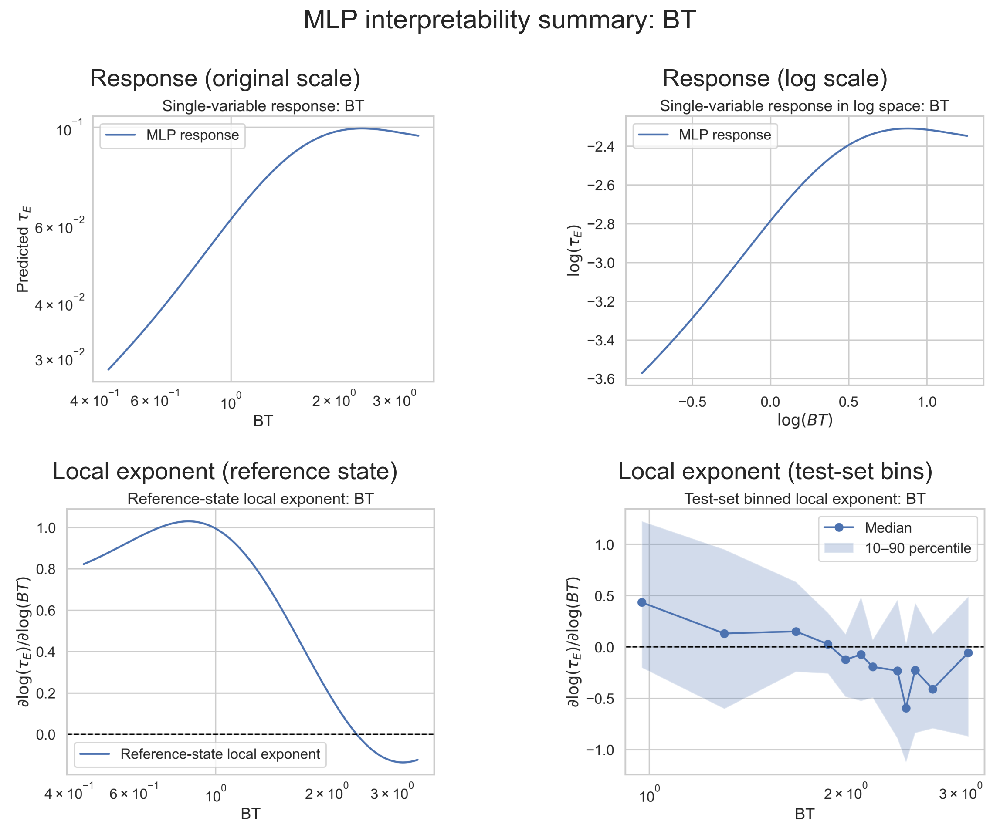

MLP 与 KAN 若对某变量给出相似结论，则说明该变量的状态依赖关系较稳定；若差异较大，则说明对该变量的非线性解释对模型结构敏感。

---

## 12. KAN-specific 解释性分析

KAN 的独特价值不在于“能否计算局部导数”，因为 MLP 也能做到；KAN 更有特色的是其函数结构可以被可视化、稀疏化、剪枝并尝试符号化。

### 12.1 剪枝前后结构

当前最优 random KAN 的结构参数为：

| 参数 | 数值 |
|---|---|
| hidden width | `[16]` |
| grid | `7` |
| spline order `k` | `5` |
| Adam steps | `1000` |
| Adam learning rate | `0.0003` |
| LBFGS steps | `120` |
| `lamb` | `0.001` |
| `lamb_entropy` | `1.0` |

KAN-specific 分析显示：

| 指标 | 原始 KAN | 剪枝后 KAN |
|---|---:|---:|
| 边数 | 160 | 28 |
| sum 节点结构 | `[16]` | `[12]` |
| mult 节点结构 | `[0]` | `[0]` |

这说明 KAN 可以从 160 条边压缩到 28 条有效边。与 MLP 相比，这种“函数网络压缩”更容易被直接解释为有效通路筛选。

### 12.2 原始 KAN 函数结构总览图

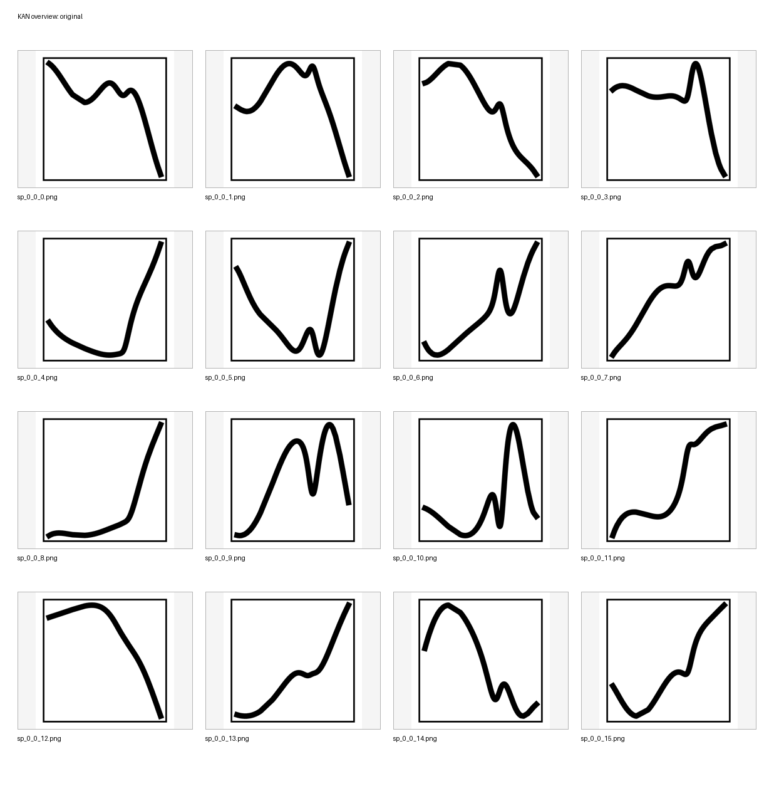

### 12.3 稀疏化 KAN 函数结构总览图

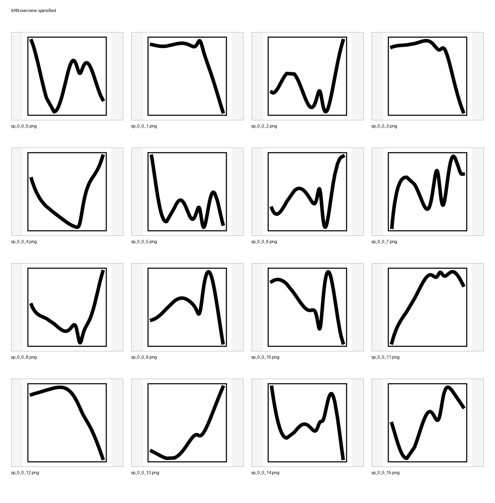

### 12.4 剪枝后 KAN 函数结构总览图

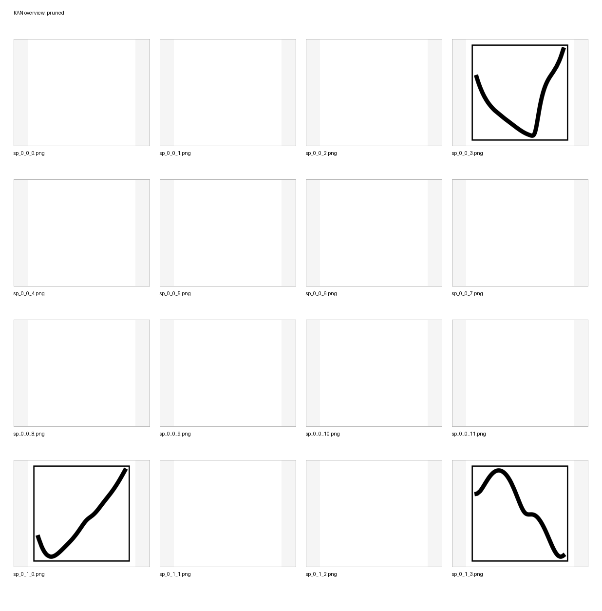

### 12.5 符号表达式与 test-set 一致性

剪枝和符号化后，当前导出的表达式可概括为：

$$
\hat y
\approx
-0.0125\log B_T
+0.6085\log I_P
+0.3452\log R
+0.0575\log \delta
+0.0742\log \epsilon
-0.0809\log \kappa
+0.0259\log M_{\rm eff}
+\Delta_{\rm nonlinear}
-0.7724.
$$

其中非线性修正项包括：

$$
\Delta_{\rm nonlinear}
=
0.2472\sin(0.4967\log\epsilon-6.7496)
+0.7598\sin(0.5326\log P_L+9.0860)
-0.7250\sin(2.2351\log R-4.1453).
$$

脚本在 `auto_symbolic` 之后，已经同时评估了：

- 数值 KAN 的 held-out test RMSE(log)：`0.1301`
- 符号 KAN 的 held-out test RMSE(log)：`1.2003`
- 符号 KAN 与数值 KAN 的一致性 RMSE(log)：`1.2005`
- 当前被选中的符号输入空间：`raw_log`

这些数字非常关键。它们说明：

1. 数值 KAN 本身在 random split test 上是有效的；
2. 当前自动符号化得到的解析式与数值 KAN 并不一致；
3. 因而“经典幂律骨架 + 非线性修正”目前还只是结构提示，而不是一个已经定量逼近数值 KAN 的最终经验公式。

因此，对 12.5 节最稳妥的表述应当是：

> 当前 auto-symbolic 提供的是一种可读的结构线索，而不是一个已经通过 test-set 数值一致性检验的最终定标律。

---

## 13. 讨论

### 13.1 主性能结论已经从 random 改为 `extrap_jet`

本版主测试不再是同分布插值，而是高 `TAUTH` `JET` 尾部外推。这个结果说明：对高约束时间单装置尾部样本，OLS 与 MLP 的外推表现相近，而当前 KAN 配置并没有显示优势。

### 13.2 `group split` 应明确写成 KAN 拟合崩溃

对于补充 `group split` 测试，不应再写“KAN 性能下降”，而应明确写：

> KAN 在 `group split` 下出现拟合崩溃，`R²(log) = -1.5049`。

结合该 run 的最优参数，可能原因包括：

- `lamb=1e-5`、`lamb_entropy=0.0`，正则太弱；
- `hidden_dims=[16,8]` 较深，在少装置训练下更容易过拟合；
- 跨装置分布转移本身显著。

因此，最直接的补做实验应是：

> `KAN group + 强正则` 对照实验，例如 `lamb=1e-3, lamb_entropy=2`。

### 13.3 KAN 的核心价值仍在结构可解释性

random split 的 9 变量局部指数表、稀疏化与剪枝结果仍然显示：KAN 可以把复杂非线性关系压缩成更可解释的函数结构。只是当前 auto-symbolic 结果尚未通过 test-set 一致性检验，因此它的价值更多是“结构提示”，而不是“最终解析律”。

---

## 14. 当前结论

1. `extrap_jet` 主测试中，OLS 与 MLP 表现接近，KAN 更差。  
   OLS、MLP、KAN 的 RMSE(log) 分别为 `0.2611`、`0.2579`、`0.3654`。

2. `group split` 作为补充压力测试时，OLS 最稳，而 KAN 出现拟合崩溃。  
   该 run 中 KAN 的 `R²(log) = -1.5049`，应明确理解为崩溃而非普通退化。

3. 关于“哪些变量近似幂律”，现在已有完整 9 变量证据。  
   `IP` 与 `PL` 最接近稳定幂律；`NEL`、`MEFF` 相对较弱但仍可对齐；`BT`、`RGEO`、`EPSILON` 以及部分几何变量表现出更明显的状态依赖。

4. KAN 的结构可解释性仍然成立。  
   random split 下，KAN 可从 160 条边压缩到 28 条边，并给出“log-linear scaling + nonlinear corrections”的可读结构。

5. 当前 auto-symbolic 解析式还没有通过数值一致性检验。  
   符号式对真值的 RMSE(log) 为 `1.2003`，对数值 KAN 的一致性 RMSE(log) 为 `1.2005`，因此它目前只能作为结构线索，而不能作为最终定标公式。

---

## 15. 后续工作

1. 补做 `KAN group + 强正则` 对照实验，优先测试 `lamb=1e-3`、`lamb_entropy=2`。
2. 对 `BT`、`RGEO`、`EPSILON` 等状态依赖最强的变量做更细的物理分区分析。
3. 对 auto-symbolic 流程加入物理约束或更强的表达式筛选，提升符号式与数值 KAN 的一致性。
4. 尝试构造“经典幂律 + 少量非线性修正项”的混合经验定标式。
5. 将主性能测试、补充 stress test 与解释性分析三条线进一步整理成论文初稿。

---

## 参考文献

1. Liu, Z. et al. **KAN: Kolmogorov-Arnold Networks**.  
2. Jing, X., Yang, X., Luo, J., Zuo, G. **Exploring Kolmogorov-Arnold neural networks for hybrid and transparent hydrological modeling**. *Environmental Modelling & Software*, 193, 106648, 2025.  
3. Liu, Z. et al. **Kolmogorov-Arnold Networks Meet Science**.  
4. Faroughi, S. A. et al. **Symbolic-KAN: Kolmogorov-Arnold Networks with Discrete Symbolic Structure for Interpretable Learning**.  
